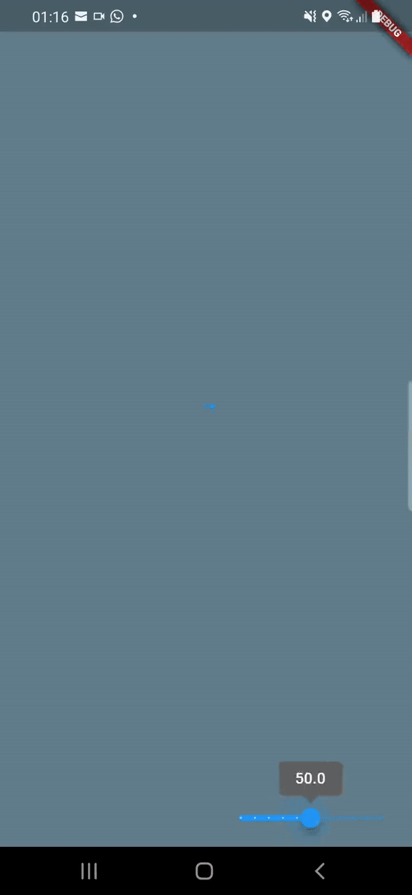

# flutter_api_golang

A new Flutter project.

## Flutter and Golang

This project is a starting point for a Flutter application frontend with Golang backend.

The idea was to create an API in Golang, with a simple product list, and then retrieve this data in a Flutter app. The end result was very satisfying and fun.

   

